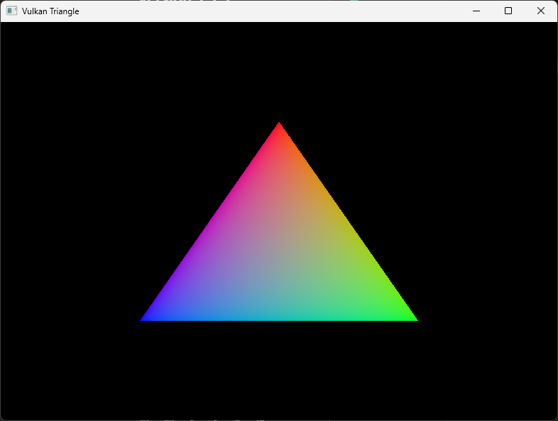

# Vulkan Triangle in C99 and Win32

A minimalist implementation of the [Vulkan Triangle tutorial](https://docs.vulkan.org/tutorial/latest/03_Drawing_a_triangle/00_Setup/00_Base_code.html) using C99 instead of C++ and Win32 instead of glfw. It is a complete and well-documented example of Vulkan initialization and triangle rendering.

## Overview

This project implements the Vulkan tutorial up to and including "Swap chain recreation", resulting in a fully functional Vulkan program. While it may seem complex (over 1200 lines) for drawing a triangle, it demonstrates proper Vulkan initialization and rendering setup.

## Design Choices

### Why C99?

I enjoy using a low-level and simple programming language that I can keep in my head without much referring to documentation too often. I've followed the [suckless.org coding style](https://suckless.org/coding_style/) as I like the coding philosophy of keeping things simple. For the structures, I decided to use designated initializers, from C99, as they are self-documenting. I've used uint32_t in vulkan.c as it's what Vulkan uses for integer values.

### Why Win32?

I want to keep library dependencies to a minimum and have control over the working details of the operating system.

## MSYS2

My development environment is MSYS2. I enjoy using a UNIX style programming environment as opposed to a full-blown IDE. gcc has better support for plain C than MSVC and MSYS2 can produce native windows binaries without extra dependencies. There is a POSIX Makefile for building the program. Vulkan headers and libraries can be installed on MSYS2. I'm using glslc.exe that is included in the Vulkan SDK and can be run from within MSYS2.

## Postmortem

Adopting C99 has proven to be a solid choice, especially for desktop games that need to compile on Windows, macOS, and Linux. While I’m unlikely to target platforms beyond desktop, I found that working with Vulkan’s low-level API was both challenging and rewarding. Using Win32 became straightforward once I discovered some well-documented examples.

One notable challenge with Vulkan is its requirement for a deep understanding of the graphics pipeline. For developers whose primary focus isn’t on graphics programming—or for those building game engines—using a higher-level API like OpenGL might be more appropriate. Even though OpenGL is considered deprecated by some, and Vulkan is designed for modern GPUs and multi-threaded CPUs, both have their merits and will likely coexist for the foreseeable future.

## Building the Project

### Prerequisites

The following MSYS2 packages are required:
- make
- mingw-w64-ucrt-x86_64-gcc
- mingw-w64-x86_64-vulkan-headers
- mingw-w64-x86_64-vulkan-loader
- mingw-w64-x86_64-vulkan-validation-layers

The project uses the `glslc.exe` compiler from the Vulkan SDK for shader compilation.

## License

This project is licensed under the MIT License - see `LICENSE.txt`.
